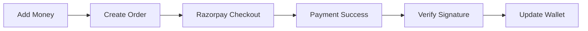

# 💰 **WorkOrbit Wallet System**

Complete wallet management with Razorpay payment integration for freelancing platform.

---

## 🚀 **Features**

- ✅ **Wallet Management** - Add/withdraw money, view balance
- ✅ **Razorpay Integration** - Secure payment gateway
- ✅ **Escrow System** - Freeze/release payments for projects
- ✅ **Transaction History** - Complete audit trail
- ✅ **Dual Role Support** - Client & freelancer wallets

---

## 🔄 **Payment Flow**

```
User → Add Money → Razorpay Order → Payment → Verification → Wallet Updated
```

### **Flow Diagram**


---

## 🏗️ **Architecture**

```
Frontend (React + Tailwind)
    ↓ API Calls
Backend (Spring Boot)
    ↓ Payment Processing
Razorpay Gateway
    ↓ Database
MySQL (Wallet + Transactions)
```

---

## 🗄️ **Database Schema**

```sql
-- Core Tables
wallet (wallet_id, user_id, role, available_balance, frozen_balance)
wallet_transaction (transaction_id, user_id, type, amount, razorpay_payment_id)
wallet_freeze (freeze_id, project_id, client_id, amount, status)
```

---

## 🔧 **Backend Structure**

```
src/main/java/com/workorbit/backend/Wallet/
├── Controller/
│   ├── WalletController.java          # CRUD operations
│   └── PaymentController.java         # Razorpay integration
├── Service/
│   ├── WalletService.java             # Business logic
│   └── RazorpayService.java           # Payment processing
├── Entity/
│   ├── Wallet.java
│   ├── WalletTransaction.java
│   └── WalletFreeze.java
└── DTO/
    ├── RazorpayOrderResponse.java
    └── VerifyPaymentRequest.java
```

---

## 🎨 **Frontend Structure**

```
src/
├── components/wallet/
│   ├── AddMoneyDialog.tsx             # Payment dialog
│   └── WalletDashboard.tsx            # Main wallet view
├── utils/razorpay.ts                  # Payment utilities
└── apis/wallet.ts                     # API calls
```

---

## 📡 **Key APIs**

```http
POST /api/wallet/add-money             # Create Razorpay order
POST /api/wallet/verify-payment        # Verify & add money
POST /api/wallet/freeze                # Freeze for project
POST /api/wallet/release               # Release to freelancer
GET  /api/wallet/{userId}              # Get wallet details
```

---

## ⚙️ **Configuration**

### **Backend (application.properties)**
```properties
razorpay.api.key=rzp_test_your_key
razorpay.api.secret=your_secret
razorpay.currency=INR
```

### **Frontend (index.html)**
```html
<script src="https://checkout.razorpay.com/v1/checkout.js"></script>
```

---

## 🚀 **Quick Start**

### **1. Backend Setup**
```bash
# Add dependency to pom.xml
<dependency>
    <groupId>com.razorpay</groupId>
    <artifactId>razorpay-java</artifactId>
    <version>1.4.3</version>
</dependency>

# Configure Razorpay keys & run
mvn spring-boot:run
```

### **2. Frontend Setup**
```bash
npm install razorpay
# Add Razorpay script to index.html
npm run dev
```

### **3. Test Payment**
```
Test Card: 4111 1111 1111 1111
Expiry: Any future date
CVV: Any 3 digits
```

---

## 🔒 **Security**

- ✅ **Signature Verification** - Razorpay payment validation
- ✅ **Duplicate Prevention** - Transaction ID tracking
- ✅ **Amount Limits** - ₹1 to ₹1,00,000
- ✅ **JWT Authentication** - Secure API access

---

## 📊 **Transaction Types**

| Type | Description |
|------|-------------|
| `CREDIT` | Money added (+Balance) |
| `DEBIT` | Money withdrawn (-Balance) |
| `FREEZE` | Amount locked for project |
| `RELEASE` | Payment to freelancer |

---

## 🐛 **Troubleshooting**

| Issue | Solution |
|-------|----------|
| Razorpay not loading | Check script in index.html |
| Payment fails | Verify Razorpay keys |
| International cards | Use test Indian cards |

---

## 🎯 **Usage Flow**

**Client:** Add Money → Hire Freelancer → Freeze Amount → Release Payment  
**Freelancer:** Receive Payment → View Earnings → Withdraw Funds

---

**Built with ❤️ for WorkOrbit Platform**