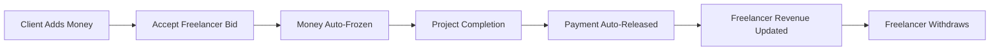
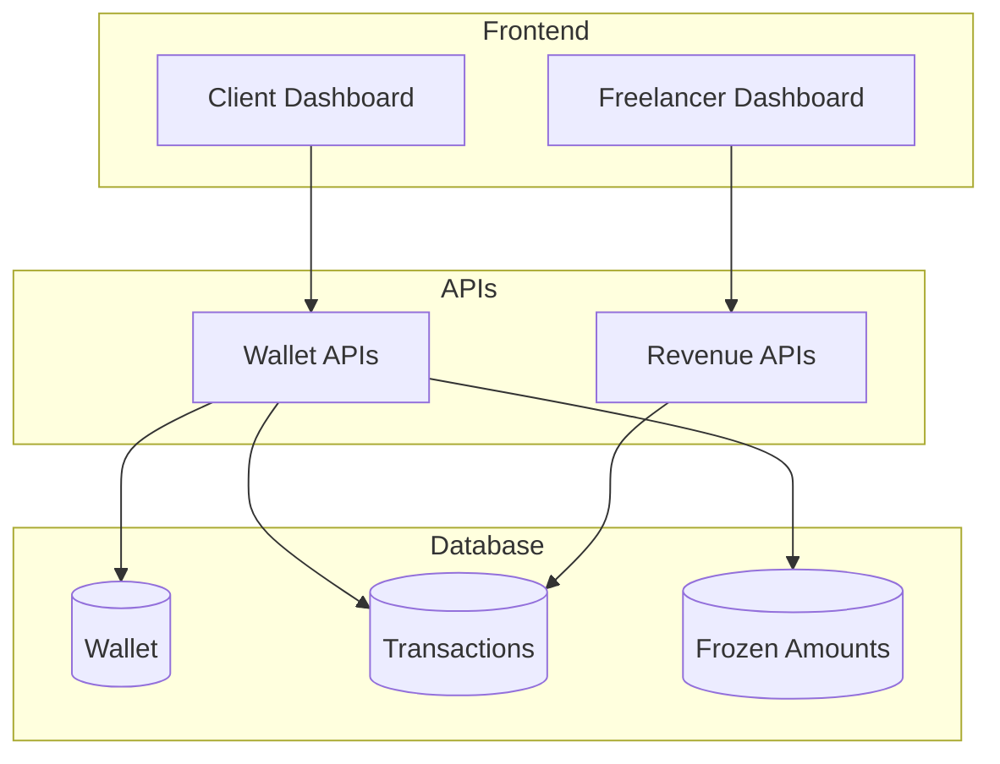
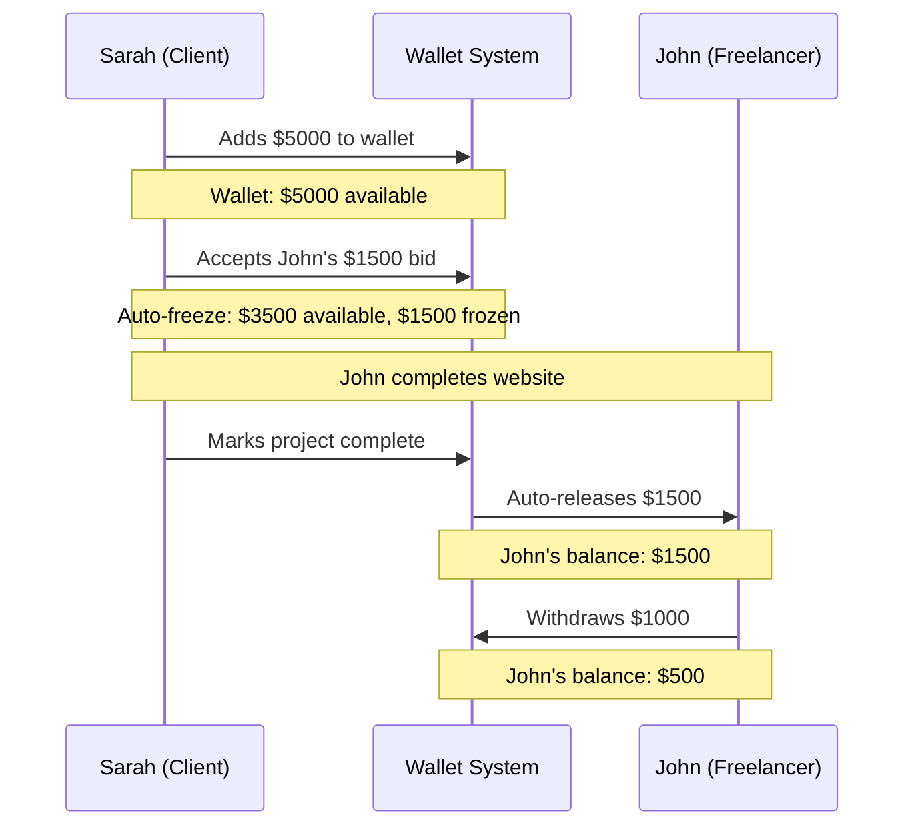

# 💰 WorkOrbit Wallet & Revenue System

## 📋 Overview

A secure wallet and revenue tracking system for the WorkOrbit freelancing platform. Handles payment processing, fund management, and earnings analytics for clients and freelancers.

### ✨ Key Features
- **💳 Wallet Management** - Add money, check balances, withdraw funds
- **🔒 Secure Payments** - Auto-freeze funds during projects
- **💸 Auto Release** - Payments released on project completion
- **📊 Revenue Tracking** - Earnings analytics for freelancers

---

## 🔄 System Flow

---

## 🏗️ Architecture Diagram

---

## 🌟 Real-Life Example

### **Scenario: Sarah hires John for website development**

### **Step-by-Step Process:**

1. **💰 Sarah adds money**: `$5000` → Wallet balance
2. **🤝 Bid acceptance**: John bids `$1500` → Sarah accepts
3. **🔒 Auto-freeze**: `$1500` frozen, `$3500` available
4. **✅ Project completion**: Sarah marks complete
5. **💸 Auto-release**: `$1500` → John's wallet
6. **📊 Revenue tracking**: John's total earnings updated
7. **🏦 Withdrawal**: John withdraws `$1000`

---

## 🔌 Key APIs

| API | Role | Purpose |
|-----|------|---------|
| `POST /api/wallet/add-money` | CLIENT | Add money to wallet |
| `GET /api/wallet/{userId}` | BOTH | Check wallet balance |
| `POST /api/wallet/withdraw` | FREELANCER | Withdraw earnings |
| `GET /api/freelancer/revenue/{id}` | FREELANCER | View earnings stats |
| `GET /api/wallet/frozen-amounts/{id}` | CLIENT | View frozen payments |

### **Automatic Triggers:**
- **Bid Acceptance** → Auto-freezes money
- **Project Completion** → Auto-releases payment

---

## 💡 Benefits

- **🔒 Secure**: Funds protected during project execution
- **⚡ Automatic**: No manual payment processing needed
- **📊 Transparent**: Clear revenue tracking for freelancers
- **🛡️ Safe**: Role-based access control
- **💰 Efficient**: Instant payments on completion

---

**Built for WorkOrbit Platform** 🚀
